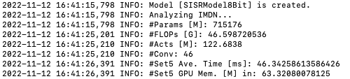
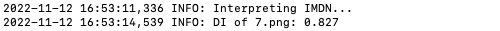
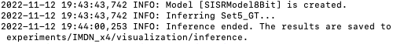

# Fried Rice Lab

## Overview

We will release the code of our works in this repository. We also provide some optimized implementations of classic and lightweight super-resolution networks.

Our works:

- [ ] ...

Optimized implementations:

- [x] EDSR: Enhanced Deep Residual Networks for Single Image Super-Resolution (CVPRW 2017)
- [x] RCAN: Image Super-Resolution Using Very Deep Residual Channel Attention Networks (ECCV 2018)
- [x] IMDN: Lightweight Image Super-Resolution with Information Multi-distillation Network (ACM MM 2019)
- [x] RFDN: Residual Feature Distillation Network for Lightweight Image Super-Resolution (ECCVW 2020)
- [x] RLFN: Residual Local Feature Network for Efficient Super-Resolution(CVPRW 2022)
- [ ] ...

In addition, we have implemented two pairs of methods `SISRDataset`, `SISRModel` and `SISRDataset8Bit`, `SISRModel8Bit`. The former inherits the data processing of `PairedImageDataset` and `SRModel` (pixel values will be normalized to `[0, 1]`), while the latter provides a new way of data processing (pixel values will remain between `[0, 255]`). Both pairs of methods offer three new features: `Analyze`, `Interpret` and `Infer`. Please replace `PairedImageDataset` and `SRModel` with one of the pair of methods to use these new features.

## How To Use

### Installation

Create a new conda environment and install PyTorch and BasicSR:

```shell
conda create -n frt
conda activate frt
conda install pytorch torchvision cudatoolkit
pip install basicsr
```

If you are having problems creating a new environment, replace your `conda` and `pip` download sources as follows:

#### conda

Please create a `.condarc` file in your `~` directory and write the following:

```
channels:
  - defaults
show_channel_urls: true
default_channels:
  - https://mirrors.tuna.tsinghua.edu.cn/anaconda/pkgs/main
  - https://mirrors.tuna.tsinghua.edu.cn/anaconda/pkgs/r
  - https://mirrors.tuna.tsinghua.edu.cn/anaconda/pkgs/msys2
custom_channels:
  conda-forge: https://mirrors.tuna.tsinghua.edu.cn/anaconda/cloud
  msys2: https://mirrors.tuna.tsinghua.edu.cn/anaconda/cloud
  bioconda: https://mirrors.tuna.tsinghua.edu.cn/anaconda/cloud
  menpo: https://mirrors.tuna.tsinghua.edu.cn/anaconda/cloud
  pytorch: https://mirrors.tuna.tsinghua.edu.cn/anaconda/cloud
  pytorch-lts: https://mirrors.tuna.tsinghua.edu.cn/anaconda/cloud
  simpleitk: https://mirrors.tuna.tsinghua.edu.cn/anaconda/cloud
```

Then, run the following command to clear the cache of conda to use the new download source:

```shell
conda clean -i
```

#### pip

Just simply run the following command:

```shell
pip config set global.index-url https://pypi.tuna.tsinghua.edu.cn/simple
```

### Preparing data

Please download the DIV2K or DF2K dataset and place it in the folder `dataset`. You can use `scripts/extract_subimages.py` and `scripts/create_lmdb.py` to process the data further. For your convenience, we added some meta_info files to the folder `datasets/meta_info` to help the Code divide the training and validation sets correctly.
For example:

```yaml
datasets:
  train:
    name: DF2K_train_3450_org
    type: SISRDataset8Bit
    dataroot_gt: datasets/DF2K/DF2K_train_HR
    dataroot_lq: datasets/DF2K/DF2K_train_LR_bicubic/X4
    meta_info_file: datasets/meta_info/DF2K_train_3450_org.txt # add this
    filename_tmpl: '{}x4'
    io_backend:
      type: disk
```

You can also use scripts/prepare.m to process your own datasets. Take the Demo dataset under the folder `datasets/original_data/Set5` as an example. First modify `scripts/prepare.m` as follows:

```
function prepare_testset()
    path_original = '../datasets/original_data'; % path to data
    degradation = 'BI'; % bicubic
    dataset = {'Set5'}; % data name
    ext = {'*.png'}; data format
```

You will get the following datasets in the `datasets` folder:

```
Set5
├── HR
│   ├── x2
│   ├── x3
│   └── x4
└── LRBI
    ├── x2
    ├── x3
    └── x4
```

### Train or Test

Based on BasicSR, you can simply train or test models, for example:

```shell
python train.py -opt options/train/RFDN/RFDN_x4.yml
python test.py -opt options/test/RFDN/RFDN_x4.yml
```

For more details, please refer to [BasicSR](https://github.com/XPixelGroup/BasicSR).

**CAUTION!** If you use `SISRDataset8Bit` and `SISRModel8Bit`, BasicSR may generate incorrect PSNR and SSIM results. Please use `scripts/evaluate.m` to calculate the correct results.

### Analyze

This method will analyse the complexity of the model and test its performance on a specific data set. Take the IMDN and Set5 datasets as an example. You can simply add the following lines to the test yml file to use this feature:

```yaml
analyse_datasets:
  analyse_1:
    name: Set5
    type: SISRDataset8Bit
    dataroot_gt: datasets/Set5/HR/x4
    dataroot_lq: datasets/Set5/LRBI/x4
    io_backend:
      type: disk
```

Then, run:

```shell
python analyse.py -opt options/test/IMDN/IMDN_x4.yml
```

You will get the following results:



For more details about the metrics, please refer to [NTIRE2022 ESR](https://github.com/ofsoundof/NTIRE2022_ESR).

### Interpret

This method comes from the paper "Interpreting Super-Resolution Networks with Local Attribution Maps". The same as `Analyze` method, you can simply add the following lines to the test yml file to use this feature:

```yaml
interpret_imgs:
  img_1:
    img_path: datasets/original_data/Urban7/7.png
    w: 110
    h: 150
```

Then, run:

```shell
python interpret.py -opt options/test/IMDN/IMDN_x4.yml
```

You will get the following results:



As well, an image will be saved in `results/IMDN_x4/visualization/7.png`.


For more details about the metrics, please refer to official [Colab](https://colab.research.google.com/drive/1ZodQ8CRCfHw0y6BweG9zB3YrK_lYWcDk?usp=sharing#scrollTo=oUaR2N96819-).

### Infer

You can use this method to super-resolve your own images. For example, if you want to super-resolve the Set5_GT dataset using IMDN. Write the following configuration to the test yml file:

```yaml
infer_datasets:
  infer_1:
    name: Set5_GT
    type: SISRDataset8Bit
    dataroot_gt: datasets/original_data/Set5
    io_backend:
      type: disk
```

The output is as follows:



## Acknowledgments

This code is built on [BasicSR](https://github.com/XPixelGroup/BasicSR). We thank its developers for creating such a useful toolbox.

## Contact

If you have any questions, please e-mail jinpeng.s@outlook.com.