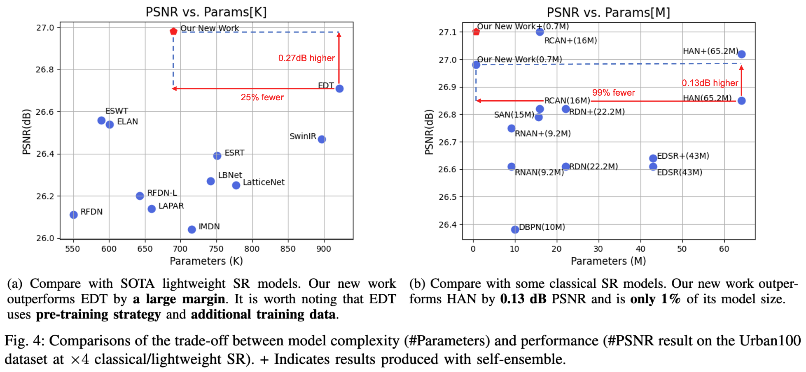
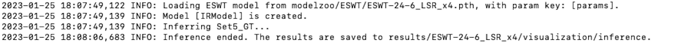
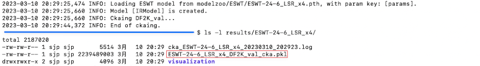
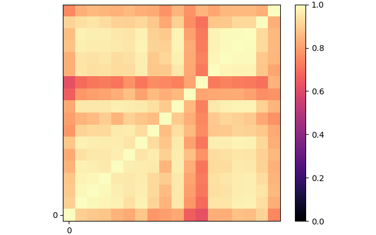
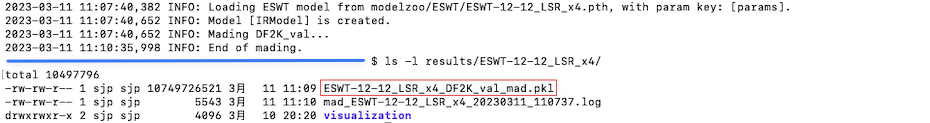
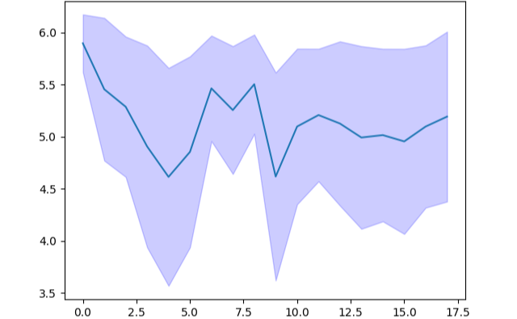
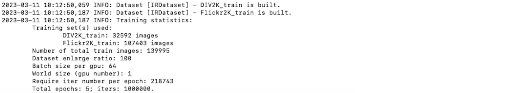

# Fried Rice Lab

We will release code resources for our works here, including:

- ESWT [arXiv]

We also implement many useful features, including:

- Allow free combination of different models and tasks with new run commands ([2 Run](#2-run))
- Analyse the complexity of a specific model on a specific task ([2.3 Analyse](#23-analyse))
- Interpret super-resolution models using local attribute maps (LAM) ([2.4 Interpret](#24-interpret))
- Restore your own images using existing models ([2.5 Infer](#25-infer))
- (New!) Measure representational similarity using minibatch centered kernel alignment ([2.6 CKA](#26-cka))
- (New!) Calculate mean attention distance of self-attention ([2.7 MAD](#27-mad))
- (New!) Combine multiple datasets as training set ([Combine Dataset](#combine-dataset))
- Train/test models with any data flow ([Data Flow](#data-flow))
- Load LMDB databases in a more customizable way ([LMDB Loading](#lmdn-loading))

And many out-of-the-box image restoration models, including:

- 2017: EDSR [CVPRW]
- 2018: RCAN [ECCV], RDN [CVPR]
- 2019: IMDN [ACM MM], RNAN [ICLR]
- 2020: CSNLN [CVPR], LAPAR [NeurIPS], LatticeNet [ECCV], PAN [ECCV], RFDN [ECCV], SAN [CVPR], HAN [ECCV]
- 2021: FDIWN [AAAI], HSENet [TGRS], SwinIR [ICCV]
- 2022: BSRN [CVPRW], ELAN [ECCV], ESRT [CVPRW], LBNet [IJCAI], NAFNet [ECCV], RLFN [CVPRW], SCET [CVPRW]

We hope this repository helps your work.

## Table of contents

<!--ts-->

- [FRL News](#frl-news)
- [Our Works](#our-works)
  - [(ESWT) Image Super-Resolution using Efficient Striped Window Transformer [arXiv]](#eswt-image-super-resolution-using-efficient-striped-window-transformer-arxiv)
- [How to Use](#how-to-use)
  - [1 Preparation](#1-preparation)
    - [1.1 Environment](#11-environment)
    - [1.2 Dataset](#12-dataset)
    - [1.3 Pretraining Weight](#13-pretraining-weight)
  - [2 Run](#2-run)
    - [2.1 Train](#21-train)
    - [2.2 Test](#22-test)
    - [2.3 Analyse](#23-analyse)
    - [2.4 Interpret](#24-interpret)
    - [2.5 Infer](#25-infer)
    - [2.6 CKA](#26-cka)
    - [2.7 MAD](#27-mad)
- [Useful Features](#useful-features)
  - [Combine Dataset](#combine-dataset)
  - [Data Flow](#data-flow)
  - [LMDB Loading](#lmdn-loading)
  - [Model Customization](#model-customization)
- [Out-Of-The-Box Models](#out-of-the-box-models)
- [Acknowledgements](#acknowledgements)
- [Contact](#contact)

<!--te-->


## FRL News

**23.02.05** Preview. We are working on **a new work** on image super-resolution, the performance of which is shown in the figure below. The manuscript and code resources will be released as soon as possible.



**23.01.31** Release the code resources of ESWT 🎉

**23.01.24** Release the manuscript of our new work ESWT on arXiv

**23.01.11** FRL code v2.0 released

**22.11.15** Here we are 🪧

## Our Works

### (ESWT) Image Super-Resolution using Efficient Striped Window Transformer [[arXiv](https://arxiv.org/abs/2301.09869)]

[Jinpeng Shi](https://github.com/jinpeng-s)*^, Hui Li, [Tianle Liu](https://github.com/TIANLE233), [Yulong Liu](https://github.com/LiuYLong), [Mingjian Zhang](https://github.com/Zhang9317112), [Jinchen Zhu](https://github.com/Jinchen2028), Ling Zheng, Shizhuang Weng^

*Transformers have achieved remarkable results in single-image super-resolution (SR). However, the challenge of balancing model performance and complexity has hindered their application in lightweight SR (LSR). To tackle this challenge, we propose an efficient striped window transformer (ESWT). We revisit the normalization layer in the transformer and design a concise and efficient transformer structure to build the ESWT. Furthermore, we introduce a striped window mechanism to model long-term dependencies more efficiently. To fully exploit the potential of the ESWT, we propose a novel flexible window training strategy that can improve the performance of the ESWT without additional cost. Extensive experiments show that ESWT outperforms state-of-the-art LSR transformers, and achieves a better trade-off between model performance and complexity. The ESWT requires fewer parameters, incurs faster inference, smaller FLOPs, and less memory consumption, making it a promising solution for LSR.* [[More details and reproduction guidance](docs/ESWT.md)]

> *: (Co-)first author(s)
>
> ^: (Co-)corresponding author(s)

## How to Use

### 1 Preparation

#### 1.1 Environment

Use the following command to build the Python environment:

```shell
conda create -n frl python
conda activate frl
pip config set global.index-url https://pypi.tuna.tsinghua.edu.cn/simple # Mainland China only!
pip install torch torchvision basicsr einops timm matplotlib
```

#### 1.2 Dataset

You can download the datasets you need from our [OneDrive](https://1drv.ms/u/s!AqKlMh-sml1mw362MfEjdr7orzds?e=budrUU) and place the downloaded datasets in the folder `datasets`. To use the YML profile we provide, keep the local folder `datasets` in the same directory tree as the OneDrive folder `datasets`.

| Task      | Dataset  | Relative Path                |
| --------- | -------- | ---------------------------- |
| SISR      | DF2K     | datasets/sr_data/DF2K        |
|           | Set5     | datasets/sr_data/Set5        |
|           | Set14    | datasets/sr_data/Set14       |
|           | BSD100   | datasets/sr_data/BSD100      |
|           | Urban100 | datasets/sr_data/Urban100    |
|           | Manga109 | datasets/sr_data/Manga109    |
| Denoising | SIDD     | datasets/denoising_data/SIDD |

> 🤠 All datasets have been processed in IMDB format and do not require any additional processing. The processing of the SISR dataset refers to the [BasicSR document](https://basicsr.readthedocs.io/en/latest/api/api_scripts.html), and the processing of the denoising dataset refers to the [NAFNet document](https://github.com/megvii-research/NAFNet/tree/main/docs).

> 🤠 To verify the integrity of your download, please refer to `docs/md5.txt`.

#### 1.3 Pretraining Weight

You can download the pretraining weights you need from our [OneDrive](https://1drv.ms/u/s!AqKlMh-sml1mw362MfEjdr7orzds?e=budrUU) and place the downloaded pretraining weights in the folder `modelzoo`. To use the YML configuration files we provide, keep the local folder `modelzoo` in the same directory tree as the OneDrive folder `modelzoo`.

| Source     | Model                                        | Relative Path |
| ---------- | -------------------------------------------- | ------------- |
| Official   | ESWT                                         | modelzoo/ESWT |
| Unofficial | [ELAN](https://github.com/xindongzhang/ELAN) | modelzoo/ELAN |

> 🤠 The unofficial pre-trained weights are trained by us. The experimental conditions are exactly the same as in their paper.

### 2 Run

When running the FRL code, unlike BasicSR, you must specify two YML configuration files. The run command should be as follows:

```shell
python ${function.py} -expe_opt ${expe.yml} -task_opt ${task.yml}
```

- `${function.py}` is the function you want to run, e.g. `test.py`
- `${expe.yml}` is the path to the experimental YML configuration file that contains the model-related and training-related configuration, e.g. `expe/ESWT/ESWT_LSR.yml`
- `${task.yml}` is the path to the task YML configuration file that contains the task-related configuration, e.g. `expe/task/LSR_x4.yml`

> 🤠 A complete experiment consists of three parts: the data, the model, and the training strategy. This design allows their configuration to be decoupled. 

For your convenience, we provide a demo test set `datasets/demo_data/Demo_Set5` and a demo pre-training weight `modelzoo/ELAN/ESWT-24-6_LSR_x4.pth`. Use the following commands to try out the main functions of the FRL code.

#### 2.1 Train

This function will train a specified model.

```shell
python train.py -expe_opt options/repr/ESWT/ESWT-24-6_LSR.yml -task_opt options/task/LSR_x4.yml
```


> 🤠 Use the following demo command instead if you prefer to run in CPU mode:
>
> ```shell
> python train.py -expe_opt options/repr/ESWT/ESWT-24-6_LSR.yml -task_opt options/task/LSR_x4.yml --force_yml num_gpu=0
> ```

#### 2.2 Test

This function will test the performance of a specified model on a specified task.

```shell
python test.py -expe_opt options/repr/ESWT/ESWT-24-6_LSR.yml -task_opt options/task/LSR_x4.yml
```


#### 2.3 Analyse

This function will analyze the complexity of a specified model on a specified task. Including the following metrics:

- **#Params**: total number of learnable parameters

- **#FLOPs**: abbreviation of floating point operations

- **#Acts**: number of elements of all outputs of convolutional layers

- **#Conv**: number of convolutional layers

- **#Memory**: maximum GPU memory consumption when inferring a dataset

- **#Ave. Time**: average inference time per image in a dataset

```shell
python analyse.py -expe_opt options/repr/ESWT/ESWT-24-6_LSR.yml -task_opt options/task/LSR_x4.yml
```


#### 2.4 Interpret

This function comes from the paper "Interpreting Super-Resolution Networks with Local Attribution Maps". When reconstructing the patches marked with red boxes, a higher DI indicates involving a larger range of contextual information, and a darker color indicates a higher degree of contribution.

```shell
python interpret.py -expe_opt options/repr/ESWT/ESWT-24-6_LSR.yml -task_opt options/task/LSR_x4.yml
```


#### 2.5 Infer

You can use this function to restore your own image.

```shell
python infer.py -expe_opt options/repr/ESWT/ESWT-24-6_LSR.yml -task_opt options/task/LSR_x4.yml
```



#### 2.6 CKA

This function comes from the paper "Do Wide and Deep Networks Learn the Same Things? Uncovering How Neural Network Representations Vary with Width and Depth", which allows you to analyze the feature representation of the SR model.

To get started, use the function `cka.py` to obtain the output of a specified layer type from a specified model.

```shell
python cka.py -expe_opt options/repr/ESWT/ESWT-24-6_LSR.yml -task_opt options/task/LSR_x4.yml --force_yml hook_layer_type=SABase4D
```



Next, employ the script `post_cka.py` to process the previously obtained `pkl` and generate the heat map of representational similarity.

```shell
python scripts/post_cka.py results/ESWT-24-6_LSR_x4/ESWT-24-6_LSR_x4_DF2K_val_cka.pkl
```



#### 2.7 MAD

This function calculates the mean attention distance (MAD) of SA layers of a specified model, which is analogous to the receptive field in CNNs.

To get started, use the function `mad.py` to obtain the attention weights of SA layers from a specified model.

```shell
python mad.py -expe_opt options/repr/ESWT/ESWT-12-12_LSR.yml -task_opt options/task/LSR_x4.yml --force_yml network_g:return_attns=true
```



Next, employ the script `post_mad.py` to process the previously obtained `pkl` and generate the line chart.

```shell
python scripts/post_mad.py results/ESWT-12-12_LSR_x4/ESWT-12-12_LSR_x4_DF2K_val_mad.pkl
```



> ⚠️ Please note that the function `mad.py` only supports **SABase4D** and **square local windows** currently. We will release the code for non-square partial windows later.
>

## Useful Features

### Combine Dataset

The FRL code provides a flexible way to combine training datasets using the parameter `extra_datasets`. Here is a demo YML profile:

```yaml
datasets:
  train:
    name: FirstDataset
    type: IRDataset
    dataroot_gt: path/to/first/dataset/HR
    dataroot_lq: path/to/first/dataset/LR

    extra_datasets:
      extra_0:
    		name: SecondDataset # Use the type of the first dataset
    		dataroot_gt: path/to/second/dataset/HR
    		dataroot_lq: path/to/second/dataset/LR

      extra_1:
    		name: ThirdDataset # Use the type of the first dataset
    		dataroot_gt: path/to/third/dataset/HR
    		dataroot_lq: path/to/third/dataset/LR
```

This will combine multiple data sets into one training set:



> 🤠 This is a simple way to process the new data set [LSDIR](https://data.vision.ee.ethz.ch/yawli/index.html) (Large Scale Dataset for Image Restoration).

### Data Flow

The image restoration process based on the BasicSR is as follows:

```
              ┌─────────┐                ┌─────────┐                 ┌─────────┐
              │  image  │───────────────▶│  model  │────────────────▶│  image  │
              └─────────┘ pre-processing └─────────┘ post-processing └─────────┘
```

By default, the pre-processing operation normalizes the input image of any bit range (e.g., an 8-bit RGB image) to the [0, 1] range, and the post-processing operation restores the output image to the original bit range. The default data flow is shown below:

```
              ┌─────────┐                ┌─────────┐                 ┌─────────┐
              │ 0-2^BIT │───────────────▶│   0-1   │────────────────▶│ 0-2^BIT │
              └─────────┘                └─────────┘                 └─────────┘
```

However, for some input images (e.g., 16-bit TIF images), this data flow may lead to unstable training or degraded performance. Therefore, the FRL code provides support for data flows of any bit range. The new data flows are shown below:

```
              ┌─────────┐                ┌─────────┐                 ┌─────────┐
              │ 0-2^BIT │───────────────▶│ 0-2^bit │────────────────▶│ 0-2^BIT │
              └─────────┘                └─────────┘                 └─────────┘
```

You can try different data flows by simply changing the parameter `bit` in the file `${expe.yml}`. Set it to `0` to use the default data flow of BasicSR.

> 🤠 We tested the impact of different data flows on the SISR task (by retraining the EDSR, RFDN, and ELAN models using 8-bit RGB images). The results show that 8-bit models (trained with 8-bit data flow) perform **slightly better** than 0-bit models.
>

> ⚠️ We **did not** test the impact of different data flows on other image restoration tasks.

> ⚠️ Using new data flows may lead to **inaccurate** metric results (PSNR: error less than 0.001; SSIM: error less than 0.00001). To get more accurate metric results, use `scripts/evaluate.m` instead.

### LMDN Loading

A standard BasicSR LMDB database structure is as follows:

```
                                        demo.lmdb
                                        ├── data.mdb
                                        ├── lock.mdb
                                        └── meta_info.txt
```

By default, BasicSR automatically reads the file `demo.lmdb/meta_info.txt` when loading the LMDB database. In the FRL code, you can specify the file `meta_info.txt` to be used when loading the LMDB database. This makes it easier to process datasets, such as splitting a dataset into a training set and a test set.

> 🤠 The LMDB database of BasicSR has a unique form. More information about LMBD database and file `mateinfo.txt` can be found in the [BasicSR document](https://basicsr.readthedocs.io/en/latest/index.html).

### Model Customization

Different from BasicSR, all models in the FRL code **must** have the following four parameters:

- `upscale`: upscale factor, e.g: 2, 3, and 4 for lsr task, 1 for denoising task
- `num_in_ch`: input channel number
- `num_out_ch`: output channel number
- `task`: image restoration task, e.g: lsr, csr or denoising

A demo model implementation is as follows:

```python
import torch


class DemoModel(torch.nn.Module):
    def __init__(self, upscale: int, num_in_ch: int, num_out_ch: int, task: str,  # noqa
                 num_groups: int, num_blocks: int, *args, **kwargs) -> None:  # noqa
        super().__init__()

    def forward(self, x: torch.Tensor) -> torch.Tensor:
        pass
```

> 🤠 The FRL code automatically assigns values to these parameters based on the task configuration file used, so you do not need to define them in the parameter `network_g`.
>
> ```yaml
> network_g:
>    type: DemoModel
>    # Only the following parameters are required!
>    num_groups: 20
>    num_blocks: 10
> ```

## Out-Of-The-Box Models

Standing on the shoulders of giants allows us to grow quickly. So, we implemented many out-of-the-box image restoration models that may help your work. Please refer to the folder `archs` and the folder `options/expe` for more details.

You can use the following command **out of the box**!

```shell
# train EDSR to solve 2x classic super-resolution task
python train.py -expe_opt options/expe/EDSR/EDSR_CSR.yml -task_opt options/task/CSR_x2.yml

# test the performance of IMDN on 3x lightweight super-resolution task
python test.py -expe_opt options/expe/IMDN/IMDN_LSR.yml -task_opt options/task/LSR_x3.yml

# analyse the complexity of RFDN on 4x classic lightweight super-resolution task
python analyse.py -expe_opt options/expe/RFDN/RFDN_LSR.yml -task_opt options/task/LSR_x4.yml
```

We provide many experimental and task YML configuration files. To perform different experiments, feel **free** to combine them in the command.

> 🤠 If these implementations help your work, please consider citing them. Please refer to file `docs/third_party_works.bib` for more information.

## Acknowledgements

This code is mainly based on [BasicSR](https://github.com/XPixelGroup/BasicSR). We thank its developers for creating such a useful toolbox. The code of the function analyse is based on [NTIRE2022 ESR](https://github.com/ofsoundof/NTIRE2022_ESR), and the code of the function interpret is based on [LAM](https://github.com/X-Lowlevel-Vision/LAM_Demo). All other image restoration model codes are from their official GitHub. More details can be found in their implementations.

## Contact

This repository is maintained by [Jinpeng Shi](https://github.com/jinpeng-s) (jinpeeeng.s@gmail.com). Special thanks to [Tianle Liu](https://github.com/TIANLE233) (tianle.l@outlook.com) for his excellent work on code testing. Due to our limited capacity, we welcome any PR.