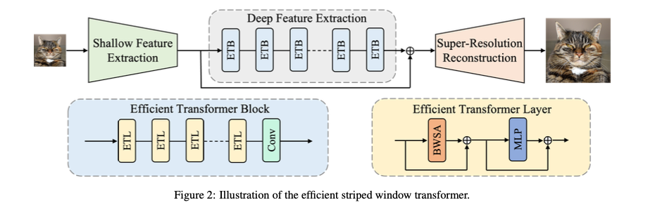
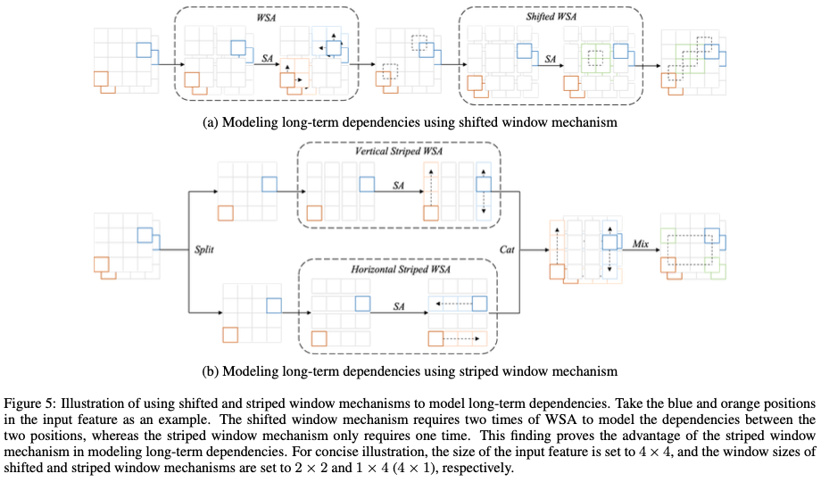
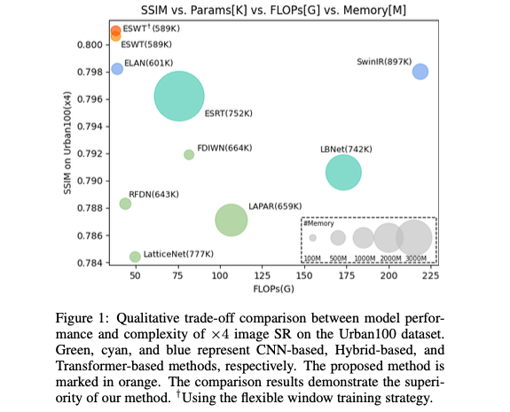
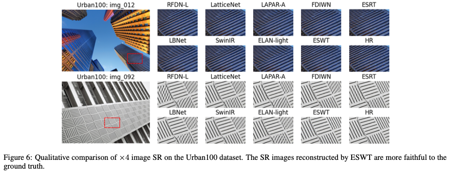
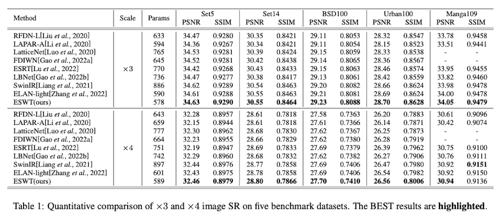
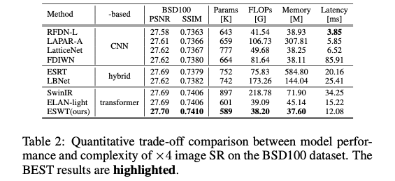
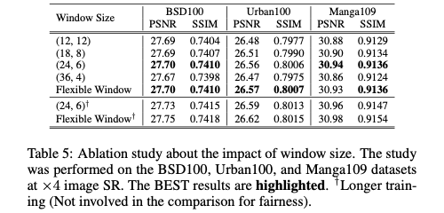

# (ESWT) Image Super-Resolution using Efficient Striped Window Transformer [[arXiv](https://arxiv.org/abs/2301.09869)]

[Jinpeng Shi](https://github.com/jinpeng-s)*^, Hui Li, [Tianle Liu](https://github.com/TIANLE233), [Yulong Liu](https://github.com/LiuYLong), [Mingjian Zhang](https://github.com/Zhang9317112), [Jinchen Zhu](https://github.com/Jinchen2028), Ling Zheng, Shizhuang Weng^

> *: First/Co-first author
>
> ^: Corresponding author

## Table of contents

<!--ts-->

- [Quick View](#quick-view)
  - [1 Abstract](#1-abstract)
  - [2 Methodology](#2-methodology)
    - [2.1 Model Design](#21-model-design)
    - [2.2 Striped Window Mechanism](#22-striped-window-mechanism)
  - [3. Experiments](#3-experiments)
    - [3.1 Trade-off between Model Performance and Complexity](#31-trade-off-between-model-performance-and-complexity)
    - [3.2 Visualization Results](#32-visualization-results)
- [Reproduction Guidance](#reproduction-guidance)
  - [1 Preparation](#1-preparation)
    - [1.1 Environment](#11-environment)
    - [1.2 Dataset](#12-dataset)
    - [1.3 Pretraining Weight](#13-pretraining-weight)
  - [2 Reproduction](#2-reproduction)
    - [2.1 Table 1 (Main results)](#21-table-1-main-results)
    - [2.2 Table 2 (Quantitative trade-off comparison between model performance and complexity)](#22-table-2-quantitative-trade-off-comparison-between-model-performance-and-complexity)
    - [2.3 Table 5 (Ablation study about the impact of window size)](#23-table-5-ablation-study-about-the-impact-of-window-size)
  - [3 Retraining](#3-retraining)
    - [3.1 ESWT using (24, 6) and (6, 24) striped windows](#31-eswt-using-24-6-and-6-24-striped-windows)
      - [3.1.1 Non-distributed training command (for single GPU)](#311-non-distributed-training-command-for-single-gpu)
      - [3.1.2 Distributed training command (for multiple (e.g., 4) GPUs)](#312-distributed-training-command-for-multiple-eg-4-gpus)
    - [3.2 ESWT using flexible window training strategy](#32-eswt-using-flexible-window-training-strategy)
      - [3.2.1 Non-distributed training command (for single GPU)](#321-non-distributed-training-command-for-single-gpu)
      - [3.2.2 Distributed training command (for multiple (e.g., 4) GPUs)](#322-distributed-training-command-for-multiple-eg-4-gpus)
- [Citation](#citation)
- [Contact](#contact)

<!--te-->

## Quick View

### 1 Abstract

*Recently, transformer-based methods have made impressive progress in single-image super-resolution (SR). However, these methods are difficult to apply to lightweight SR (LSR) due to the challenge of balancing model performance and complexity. In this paper, we propose an efficient striped window transformer (ESWT). ESWT consists of efficient transformation layers (ETLs), allowing a clean structure and avoiding redundant operations. Moreover, we designed a striped window mechanism to obtain a more efficient ESWT in modeling long-term dependencies. To further exploit the potential of the transformer, we propose a novel flexible window training strategy. Without any additional cost, this strategy can further improve the performance of ESWT. Extensive experiments show that the proposed method outperforms state-of-the-art transformer-based LSR methods with fewer parameters, faster inference, smaller FLOPs, and less memory consumption, achieving a better trade-off between model performance and complexity.*

### 2 Methodology

#### 2.1 Model Design



#### 2.2 Striped Window Mechanism



### 3. Experiments

#### 3.1 Trade-off between Model Performance and Complexity



#### 3.2 Visualization Results



## Reproduction Guidance

### 1 Preparation

#### 1.1 Environment

Use the following command to build the Python environment:

```shell
conda create -n frl python
conda activate frl
pip config set global.index-url https://pypi.tuna.tsinghua.edu.cn/simple # Mainland China only!
pip install torch torchvision basicsr einops timm matplotlib
```

#### 1.2 Dataset

Please download the following dataset from our [OneDrive](https://1drv.ms/u/s!AqKlMh-sml1mw362MfEjdr7orzds?e=budrUU) and place the downloaded datasets in the folder `datasets`. **Keep** the local folder `datasets` in the same directory tree as the OneDrive folder `datasets`.

| Dataset  | Type          | Description                   |
| -------- | ------------- | ----------------------------- |
| DF2K     | train/val set | Required for retraining only! |
| Set5     | test set      |                               |
| Set14    | test set      |                               |
| BSD100   | test set      |                               |
| Urban100 | test set      |                               |
| Manga109 | test set      |                               |

#### 1.3 Pretraining Weight

Please download the following pretraining weights from our [OneDrive](https://1drv.ms/u/s!AqKlMh-sml1mw362MfEjdr7orzds?e=budrUU) and place the downloaded pretraining weights in the folder `modelzoo`. **Keep** the local folder `modelzoo` in the same directory tree as the OneDrive folder `modelzoo`.

| Pretraining Weight | Description                                    |
| ------------------ | ---------------------------------------------- |
| ESWT-24-6_LSR_x4   | ESWT using (24, 6) and (6, 24) striped windows |
| ESWT-12-12_LSR_x4  | ESWT using (12, 12) window                     |
| ESWT-fw_LSR_x4     | ESWT using flexible window training strategy   |

### 2 Reproduction

Please use the commands we provide to reproduce the experimental results in the paper.

You may need to make some **manual changes** to file `options/task/LSR_x4.yml`, such as uncommenting certain lines.

#### 2.1 Table 1 (Main results)

```shell
# ESWT using (24, 6) and (6, 24) striped windows
python test.py -expe_opt options/repr/ESWT/ESWT-24-6_LSR.yml -task_opt options/task/LSR_x4.yml
```

> 🤠 Use the following command instead if you want to save the super-resolution results:
>
> ```shell
> python test.py -expe_opt options/repr/ESWT/ESWT-24-6_LSR.yml -task_opt options/task/LSR_x4.yml --force_yml val:save_img=true
> ```

> 🤠 Use the following command instead if you prefer to run in CPU mode:
>
> ```shell
> python test.py -expe_opt options/repr/ESWT/ESWT-24-6_LSR.yml -task_opt options/task/LSR_x4.yml --force_yml num_gpu=0
> ```



#### 2.2 Table 2 (Quantitative trade-off comparison between model performance and complexity)

```shell
# RFDN-L
python analyse.py -expe_opt options/expe/RFDN/RFDN-L_LSR.yml -task_opt options/task/LSR_x4.yml
# LAPAR-A
python analyse.py -expe_opt options/expe/LAPAR/LAPAR-A_LSR.yml -task_opt options/task/LSR_x4.yml
# LatticeNet
python analyse.py -expe_opt options/expe/LatticeNet/LatticeNet_LSR.yml -task_opt options/task/LSR_x4.yml
# FDIWN
python analyse.py -expe_opt options/expe/FDIWN/FDIWN_LSR.yml -task_opt options/task/LSR_x4.yml

# ESRT
python analyse.py -expe_opt options/expe/ESRT/ESRT_LSR.yml -task_opt options/task/LSR_x4.yml
# LBNet
python analyse.py -expe_opt options/expe/LBNet/LBNet-T_LSR.yml -task_opt options/task/LSR_x4.yml

# SwinIR
python analyse.py -expe_opt options/expe/SwinIR/SwinIR_LSR.yml -task_opt options/task/LSR_x4.yml
# ELAN-light
python analyse.py -expe_opt options/expe/ELAN/ELAN_LSR.yml -task_opt options/task/LSR_x4.yml
# ESWT
python analyse.py -expe_opt options/repr/ESWT/ESWT-24-6_LSR.yml -task_opt options/task/LSR_x4.yml
```



#### 2.3 Table 5 (Ablation study about the impact of window size)

```shell
# ESWT using (12, 12) window
python test.py -expe_opt options/repr/ESWT/ESWT-12-12_LSR.yml -task_opt options/task/LSR_x4.yml
# ESWT using flexible window training strategy
python test.py -expe_opt options/repr/ESWT/ESWT-fw_LSR.yml -task_opt options/task/LSR_x4.yml
```



### 3 Retraining

#### 3.1 ESWT using (24, 6) and (6, 24) striped windows

##### 3.1.1 Non-distributed training command (for single GPU)

```shell
python train.py -expe_opt options/expe/ESWT/ESWT-24-6_LSR.yml -task_opt options/task/LSR_x4.yml
```

##### 3.1.2 Distributed training command (for multiple (e.g., 4) GPUs)

```shell
CUDA_VISIBLE_DEVICES=0,1,2,3 \
  python \
  -u -m torch.distributed.run \
  --nproc_per_node=4 \
  --master_port=4000 \
  train.py \
  -expe_opt options/expe/ESWT/ESWT_LSR.yml \
  -task_opt options/task/LSR_x4.yml \
  --launcher pytorch \
  --force_yml train:batch_size_per_gpu=16  # 16 = 64 / 4
```

> 🤠 Please modify `CUDA_VISIBLE_DEVICES`, `--nproc_per_node` and `train:batch_size_per_gpu` according to your experimental conditions.

#### 3.2 ESWT using flexible window training strategy

##### 3.2.1 Non-distributed training command (for single GPU)

```shell
# Stage one
python train.py -expe_opt options/expe/ESWT/ESWT_fw-stage1_LSR.yml -task_opt options/task/LSR_x4.yml
# Stage two
python train.py -expe_opt options/expe/ESWT/ESWT_fw-stage2_LSR.yml -task_opt options/task/LSR_x4.yml --force_yml path:pretrain_network_g=path/to/stage/one/net_g_latest.pth
# Stage three
python train.py -expe_opt options/expe/ESWT/ESWT_fw-stage3_LSR.yml -task_opt options/task/LSR_x4.yml --force_yml path:pretrain_network_g=path/to/stage/two/net_g_latest.pth
```

> 🤠 Please specify the correct path for `path:pretrain_network_g`.

##### 3.2.2 Distributed training command (for multiple (e.g., 4) GPUs)

Please refer to section 3.1.2 for more information.

## Citation

Please consider citing ESWT if it helps you in your work.

```
@article{shi2023eswt,
  title = {Image Super-Resolution using Efficient Striped Window Transformer},
  author = {Shi, Jinpeng and Li, Hui and Liu, Tianle and Liu, Yulong and Zhang, Mingjian and Zhu, Jinchen and Zheng, Ling and Weng, Shizhuang},
  journal={arXiv preprint arXiv:2301.09869},
  year = {2023},
}
```

## Contact

If you have any questions, please contact [Jinpeng Shi](https://github.com/jinpeng-s) (jinpeeeng.s@gmail.com), Shizhuang Weng (weng_1989@126.com).