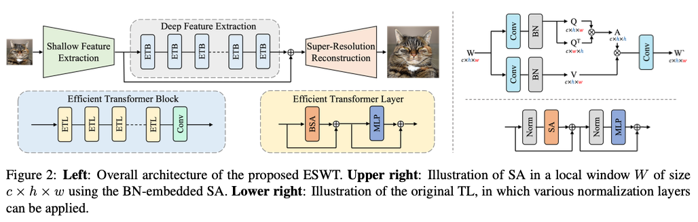
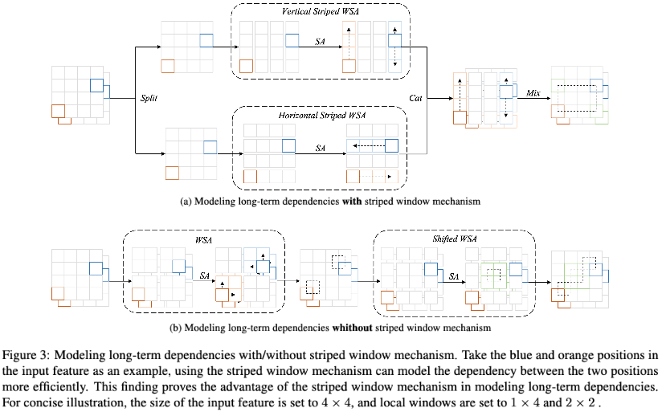
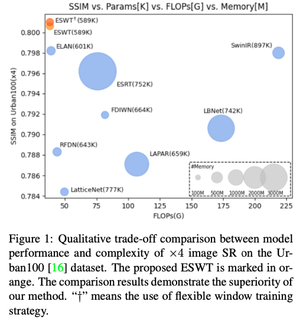
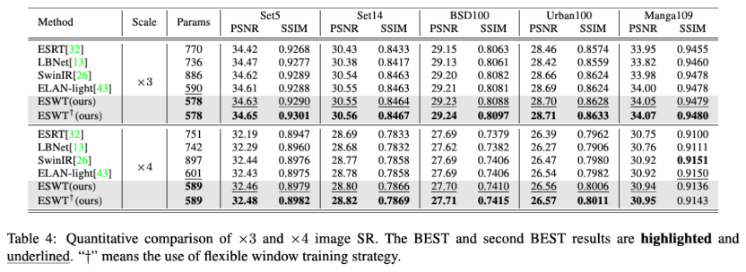
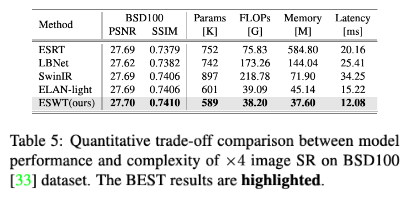

# (ESWT) Image Super-Resolution using Efficient Striped Window Transformer [[arXiv](https://arxiv.org/abs/2301.09869)]

[Jinpeng Shi](https://github.com/jinpeng-s)*^, Hui Li, [Tianle Liu](https://github.com/TIANLE233), [Yulong Liu](https://github.com/LiuYLong), [Mingjian Zhang](https://github.com/Zhang9317112), [Jinchen Zhu](https://github.com/Jinchen2028), Ling Zheng, Shizhuang Weng^

> *: (Co-)first author(s)
>
> ^: (Co-)corresponding author(s)

## Table of contents

<!--ts-->

- [Quick View](#quick-view)
  - [1 Abstract](#1-abstract)
  - [2 Methodology](#2-methodology)
    - [2.1 Model Design](#21-model-design)
    - [2.2 Striped Window Mechanism](#22-striped-window-mechanism)
  - [3. Experiments](#3-experiments)
    - [3.1 Trade-off between Model Performance and Complexity](#31-trade-off-between-model-performance-and-complexity)
    - [3.2 Visualization Results](#32-visualization-results)
- [Reproduction Guidance](#reproduction-guidance)
  - [1 Preparation](#1-preparation)
    - [1.1 Environment](#11-environment)
    - [1.2 Dataset](#12-dataset)
    - [1.3 Pretraining Weight](#13-pretraining-weight)
  - [2 Reproduction](#2-reproduction)
    - [2.1 Table 4 (Main results)](#21-table-4-main-results)
    - [2.2 Table 5 (Quantitative trade-off comparison between model performance and complexity)](#22-table-5-quantitative-trade-off-comparison-between-model-performance-and-complexity)
  - [3 Retraining](#3-retraining)
    - [3.1 ESWT using (24, 6) striped window](#31-eswt-using-24-6-striped-window)
      - [3.1.1 Non-distributed training command (for single GPU)](#311-non-distributed-training-command-for-single-gpu)
      - [3.1.2 Distributed training command (for multiple (e.g., 4) GPUs)](#312-distributed-training-command-for-multiple-eg-4-gpus)
    - [3.2 ESWT using flexible window training strategy](#32-eswt-using-flexible-window-training-strategy)
      - [3.2.1 Non-distributed training command (for single GPU)](#321-non-distributed-training-command-for-single-gpu)
      - [3.2.2 Distributed training command (for multiple (e.g., 4) GPUs)](#322-distributed-training-command-for-multiple-eg-4-gpus)
- [Citation](#citation)
- [Contact](#contact)

<!--te-->

## Quick View

### 1 Abstract

*Transformers have achieved remarkable results in single-image super-resolution (SR). However, the challenge of balancing model performance and complexity has hindered their application in lightweight SR (LSR). To tackle this challenge, we propose an efficient striped window transformer (ESWT). We revisit the normalization layer in the transformer and design a concise and efficient transformer structure to build the ESWT. Furthermore, we introduce a striped window mechanism to model long-term dependencies more efficiently. To fully exploit the potential of the ESWT, we propose a novel flexible window training strategy that can improve the performance of the ESWT without additional cost. Extensive experiments show that ESWT outperforms state-of-the-art LSR transformers, and achieves a better trade-off between model performance and complexity. The ESWT requires fewer parameters, incurs faster inference, smaller FLOPs, and less memory consumption, making it a promising solution for LSR.*

### 2 Methodology

#### 2.1 Model Design



#### 2.2 Striped Window Mechanism



### 3. Experiments

#### 3.1 Trade-off between Model Performance and Complexity



#### 3.2 Visualization Results


## Reproduction Guidance

### 1 Preparation

#### 1.1 Environment

Use the following command to build the Python environment:

```shell
conda create -n frl python
conda activate frl
pip config set global.index-url https://pypi.tuna.tsinghua.edu.cn/simple # Mainland China only!
pip install torch torchvision basicsr einops timm matplotlib
```

#### 1.2 Dataset

Please download the following dataset from our [OneDrive](https://1drv.ms/u/s!AqKlMh-sml1mw362MfEjdr7orzds?e=budrUU) and place the downloaded datasets in the folder `datasets`. **Keep** the local folder `datasets` in the same directory tree as the OneDrive folder `datasets`.

| Dataset  | Type          | Description                   |
| -------- | ------------- | ----------------------------- |
| DF2K     | train/val set | Required for retraining only! |
| Set5     | test set      |                               |
| Set14    | test set      |                               |
| BSD100   | test set      |                               |
| Urban100 | test set      |                               |
| Manga109 | test set      |                               |

#### 1.3 Pretraining Weight

Please download the following pretraining weights from our [OneDrive](https://1drv.ms/u/s!AqKlMh-sml1mw362MfEjdr7orzds?e=budrUU) and place the downloaded pretraining weights in the folder `modelzoo`. **Keep** the local folder `modelzoo` in the same directory tree as the OneDrive folder `modelzoo`.

| Pretraining Weight | Description                        |
|--------------------|------------------------------------|
| ESWT-12-12_LSR_x4  | ESWT using (12, 12) striped window |
| ESWT-24-6_LSR_x4   | ESWT using (24, 6) striped window  |

### 2 Reproduction

Please use the commands we provide to reproduce the experimental results in the paper.

You may need to make some **manual changes** to file `options/task/LSR_x4.yml`, such as uncommenting certain lines.

#### 2.1 Table 4 (Main results)

```shell
# ESWT using (24, 6) striped window
python test.py -expe_opt options/repr/ESWT/ESWT-24-6_LSR.yml -task_opt options/task/LSR_x4.yml
```

> 🤠 Use the following command instead if you want to save the super-resolution results:
>
> ```shell
> python test.py -expe_opt options/repr/ESWT/ESWT-24-6_LSR.yml -task_opt options/task/LSR_x4.yml --force_yml val:save_img=true
> ```

> 🤠 Use the following command instead if you prefer to run in CPU mode:
>
> ```shell
> python test.py -expe_opt options/repr/ESWT/ESWT-24-6_LSR.yml -task_opt options/task/LSR_x4.yml --force_yml num_gpu=0
> ```



#### 2.2 Table 5 (Quantitative trade-off comparison between model performance and complexity)

```shell
# ESRT
python analyse.py -expe_opt options/expe/ESRT/ESRT_LSR.yml -task_opt options/task/LSR_x4.yml
# LBNet
python analyse.py -expe_opt options/expe/LBNet/LBNet-T_LSR.yml -task_opt options/task/LSR_x4.yml
# SwinIR
python analyse.py -expe_opt options/expe/SwinIR/SwinIR_LSR.yml -task_opt options/task/LSR_x4.yml
# ELAN-light
python analyse.py -expe_opt options/expe/ELAN/ELAN_LSR.yml -task_opt options/task/LSR_x4.yml
# ESWT
python analyse.py -expe_opt options/repr/ESWT/ESWT-24-6_LSR.yml -task_opt options/task/LSR_x4.yml
```



### 3 Retraining

#### 3.1 ESWT using (24, 6) striped window

##### 3.1.1 Non-distributed training command (for single GPU)

```shell
python train.py -expe_opt options/expe/ESWT/ESWT_LSR.yml -task_opt options/task/LSR_x4.yml
```

##### 3.1.2 Distributed training command (for multiple (e.g., 4) GPUs)

```shell
CUDA_VISIBLE_DEVICES=0,1,2,3 \
  python \
  -u -m torch.distributed.run \
  --nproc_per_node=4 \
  --master_port=4000 \
  train.py \
  -expe_opt options/expe/ESWT/ESWT_LSR.yml \
  -task_opt options/task/LSR_x4.yml \
  --launcher pytorch \
  --force_yml train:batch_size_per_gpu=16  # 16 = 64 / 4
```

> 🤠 Please modify `CUDA_VISIBLE_DEVICES`, `--nproc_per_node` and `train:batch_size_per_gpu` according to your experimental conditions.

#### 3.2 ESWT using flexible window training strategy

##### 3.2.1 Non-distributed training command (for single GPU)

```shell
# Stage one
python train.py -expe_opt options/expe/ESWT/ESWT_fw-stage1_LSR.yml -task_opt options/task/LSR_x4.yml
# Stage two
python train.py -expe_opt options/expe/ESWT/ESWT_fw-stage2_LSR.yml -task_opt options/task/LSR_x4.yml --force_yml path:pretrain_network_g=path/to/stage/one/net_g_latest.pth
# Stage three
python train.py -expe_opt options/expe/ESWT/ESWT_fw-stage3_LSR.yml -task_opt options/task/LSR_x4.yml --force_yml path:pretrain_network_g=path/to/stage/two/net_g_latest.pth
```

> 🤠 Please specify the correct path for `path:pretrain_network_g`.

##### 3.2.2 Distributed training command (for multiple (e.g., 4) GPUs)

Please refer to section 3.1.2 for more information.

## Citation

Please consider citing ESWT if it helps you in your work.

```
@article{shi2023eswt,
  title = {Image Super-Resolution using Efficient Striped Window Transformer},
  author = {Shi, Jinpeng and Li, Hui and Liu, Tianle and Liu, Yulong and Zhang, Mingjian and Zhu, Jinchen and Zheng, Ling and Weng, Shizhuang},
  journal={arXiv preprint arXiv:2301.09869},
  year = {2023},
}
```

## Contact

If you have any questions, please contact [Jinpeng Shi](https://github.com/jinpeng-s) (jinpeeeng.s@gmail.com), Shizhuang Weng (weng_1989@126.com).