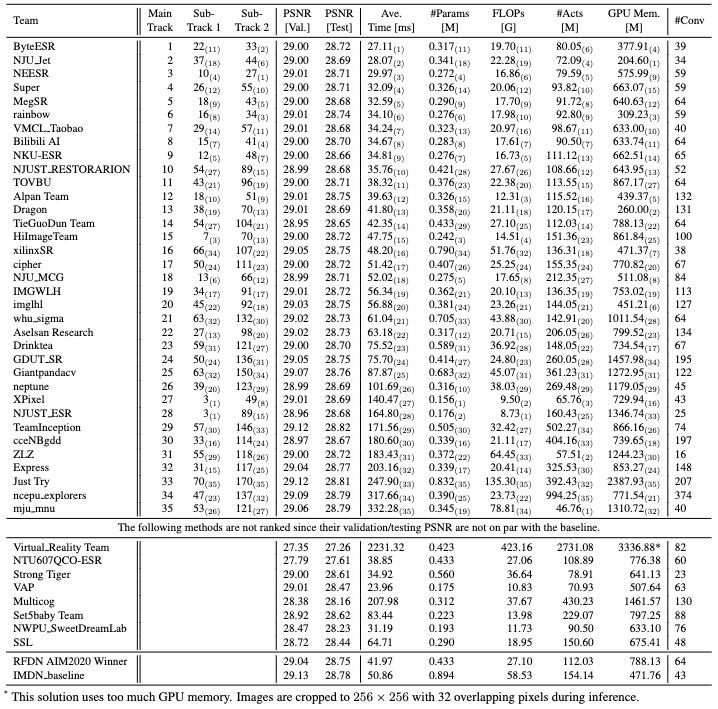
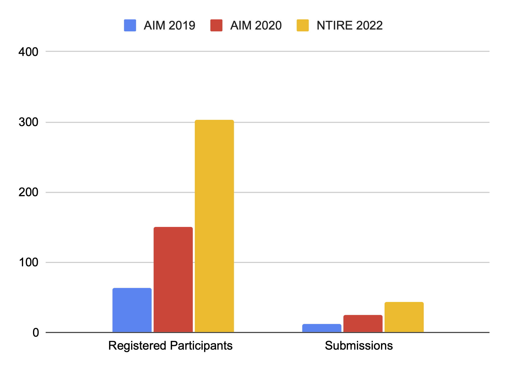

# [NTIRE 2022 Challenge on Efficient Super-Resolution](https://data.vision.ee.ethz.ch/cvl/ntire22/) @ [CVPR 2022](https://cvpr2022.thecvf.com/)

## About the Challenge
Jointly with NTIRE workshop we have a challenge on Efficient Super-Resolution, that is, the task of super-resolving (increasing the resolution) an input image with a magnification factor x4 based on a set of prior examples of low and corresponding high resolution images. The challenge has three tracks.

**Track 1: Inference Runtime**, the aim is to obtain a network design / solution with the lowest inference time (runtime) on a common GPU (ie. Titan Xp) while being constrained to maintain or improve over IMDN ([Hui et al, 2019](https://arxiv.org/abs/1909.11856)) in terms of number of parameters and the PSNR result.

**Track 2: Model Complexity (Parameters and FLOPs)**, the aim is to obtain a network design / solution with the lowest amount of parameters and FLOPs while being constrained to maintain or improve the PSNR result and the inference time (runtime) of IMDN ([Hui et al, 2019](https://arxiv.org/abs/1909.11856)).

**Track 3: Overall Performance (Runtime, Parameters, FLOPs, Activation, Memory)**, the aim is to obtain a network design / solution with the best overall performance in terms of number of parameters, FLOPS, activations, and inference time and GPU memory on a common GPU (ie. Titan Xp).

## Challenge results

Results of NTIRE 2022 Efficient SR Challenge. 
The underscript numbers in parentheses following each metric value denotes the ranking of the solution in terms of that metric.
- "Ave. Time" is averaged on DIV2K validation and test datasets.
- "#Params" denotes the total number of parameters. 
- "FLOPs" is the abbreviation for floating point operations. 
- "#Acts" measures the number of elements of all outputs of convolutional layers. 
- "GPU Mem." represents maximum GPU memory consumption according to the PyTorch function `torch.cuda.max_memory_allocated()` during the inference on DIV2K validation set. 
- "#Conv" represents the number of convolutional layers. 
- "FLOPs" and "#Acts are tested on an LR image of size 256x256. 

**This is not a challenge for PSNR improvement. The "validation/testing PSNR" and "#Conv" are not ranked**.



## Conclusions

1. The efficient image SR community is growing. This year the challenge had 303 registered participants, and received 43 valid submissions, which is a significant boost compared with the previous years.
    

2. The family of the proposed solutions during this challenge keep to push the frontier of the research and implementation of efficient images SR. 
3. In conjunction with the previous series of the efficient SR challenge including AIM 2019 Constrained SR Challenge and AIM 2020 Efficient SR Challenge, the proposed solutions make new records of network efficiency in term of metrics such as runtime and model complexity while maintain the accuracy of the network.
4. There is a divergence between the actual runtime and theoretical model complexity of the proposed networks. This shows that the theoretical model complexity including FLOPs and the number of parameters do not correlate well with the actual runtime at least on GPU infrastructures.
5. In the meanwhile, new developments in the efficient SR field are also observed, which include but not limited to the following aspects.
   1. The effectiveness of multi-stage information distillation mechanism is challenged by the first two place solutions in the runtime main track. 
   2. Other techniques such as contrastive loss, network pruning, and convolution reparameterization began to play a role for efficient SR.

## References
```BibTex
@inproceedings{li2022ntire,
  title={NTIRE 2022 Challenge on Efficient Super-Resolution: Methods and Results},
  author={Li, Yawei and Zhang, Kai and Timofte, Radu and Van Gool, Luc and others},
  booktitle={Proceedings of the IEEE/CVF Conference on Computer Vision and Pattern Recognition Workshops},
  year={2022}
}

@inproceedings{zhang2020aim,
  title={AIM 2020 Challenge on Efficient Super-Resolution: Methods and Results},
  author={Zhang, Kai and Danelljan, Martin and Li, Yawei and Timofte, Radu and others},
  booktitle={Proceedings of the European Conference on Computer Vision Workshops},
  year={2020}
}

@inproceedings{zhang2019aim,
  title={AIM 2019 Challenge on Constrained Super-Resolution: Methods and results},
  author={Zhang, Kai and Gu, Shuhang and Timofte, Radu and others},
  booktitle={Proceedings of the IEEE/CVF International Conference on Computer Vision Workshops},
  year={2019},
}
```

## License and Acknowledgement
This code repository is release under [MIT License](LICENSE). 
The code repository is a result of the contribution from all the NTIRE 2022 Efficient SR participants.
